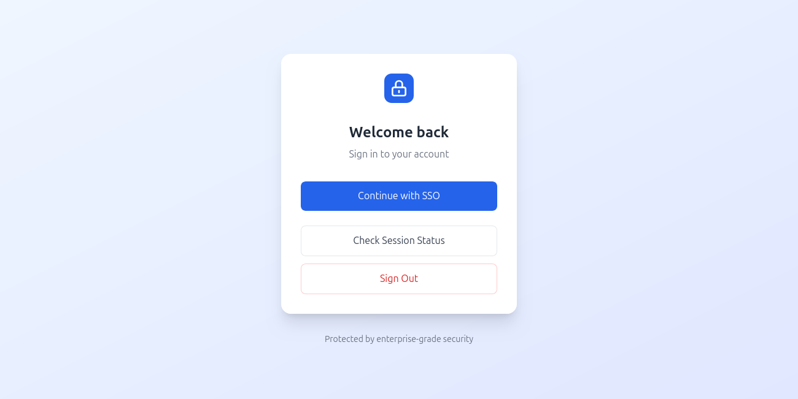

# Golang SSO (Single Sign-On) Service

A robust Single Sign-On service built with Go, leveraging OAuth2 for authentication with Google.



## Features

- OAuth2 authentication with Google
- Session management
- User creation and updates
- Secure cookie handling
- Domain-specific email validation (@mesika.org)
- Clean architecture with separation of concerns

## Prerequisites

- Go 1.18+
- PostgreSQL 13+
- Google OAuth2 credentials

## Installation

1. Clone the repository:
   ```bash
   git clone https://github.com/yeboahd24/golang-sso.git
   cd golang-sso
